# 飞牛OS部署  
## 项目准备  
> 1. 项目文件  
> 2. Fnos网页端  
> 3. Fnos后端  

## 下载并修改项目  
1. 下载项目到本地，无论是什么系统，下载完后解压，此操作无需在Fnos上做，可以在windows或者别的操作系统中执行    
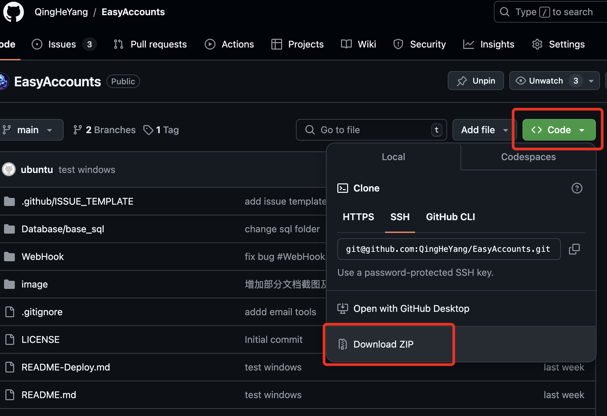  

2. 修改项目内容  
- 在 `./Database/`文件夹下创建init文件夹
- **新用户**：将 `./Database/base_sql/yd_jz_base.sql` 复制到`./Database/init`中  
- **老用户**：将曾经备份好的数据库sql文件，放到`./Database/init`中修改完的项目结构如下：  
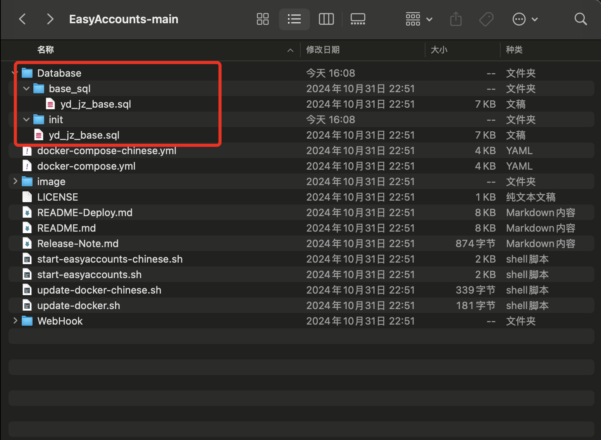  


3. （可选）老用户可以选择将自己的docker-compose.yml替换掉新下载项目的对应compose文件  

> Tips:如果使用曾经的项目文件夹也可以，请务必将`./Database/data`文件夹删除掉！！如果项目部署失败，也需要删除掉这个文件夹！  

## 上传项目  
1. 选择刚才修改好文件夹并上传  
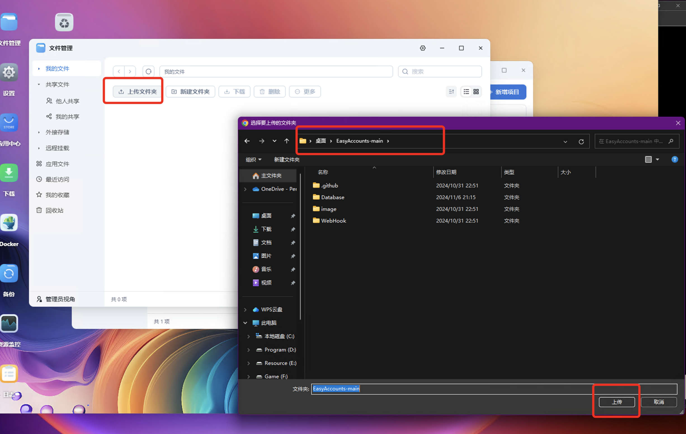  

2. 上传后结果  
  

## 数据库文件提权  
### 去Fnos后台登录  
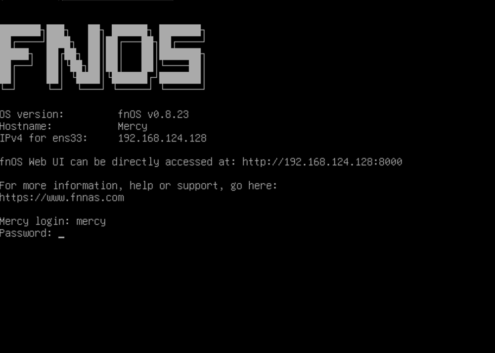  

### 找到自己刚才上传的文件夹的位置  
注意文件夹名称可能不是EasyAccounts-main
```
sudo find / -type d -name "EasyAccounts-main" 2>/dev/null 
```  
执行过程会要登录密码
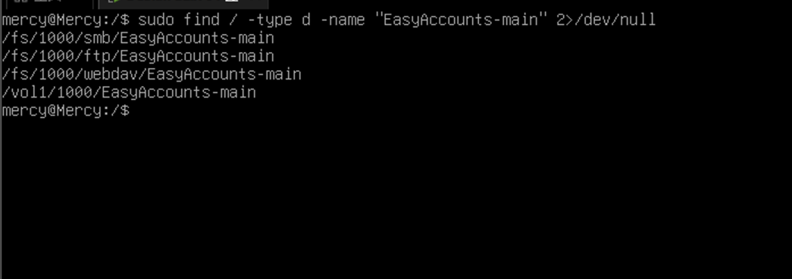  

进入到最后一个`/vol1/1000/EasyAccounts-main`中，前几个也同样可以进去，但是保存位置确实在最后一个  
```
cd vol1/1000/EasyAccounts-main  
ll
```

### 提权  
```
sudo chown -R 999:999 ./Database/init  
```
执行后进入`Databse`文件夹确认权限  
```
ll
```
看到如下则提权成功  
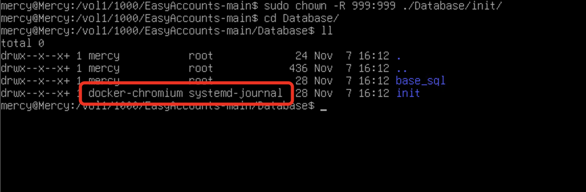    

## 部署构建  
### 部署  
回到浏览器  
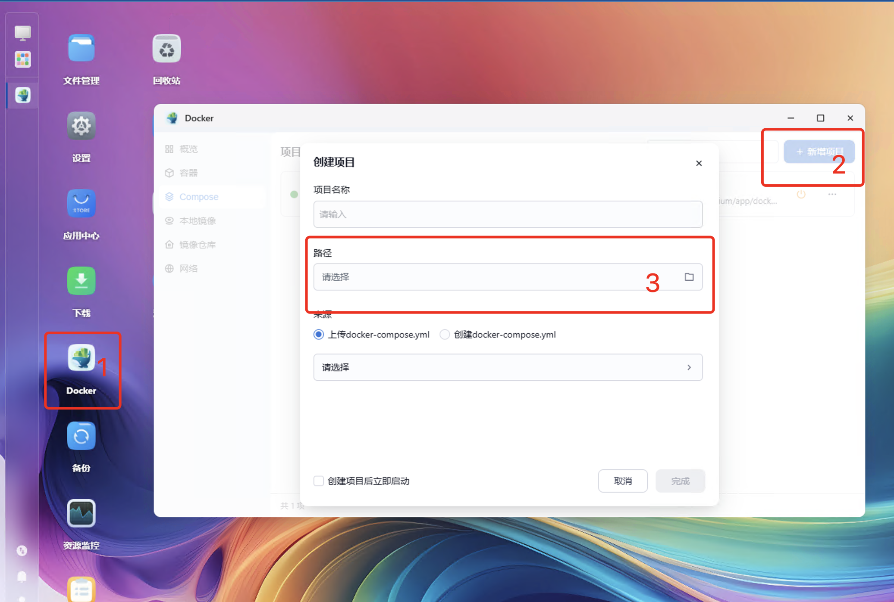 
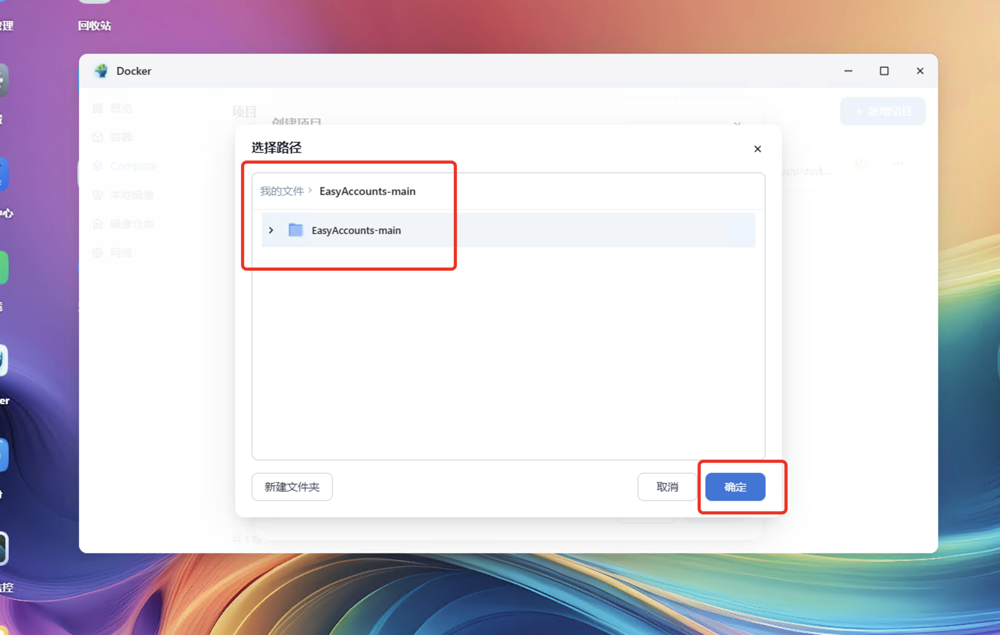 
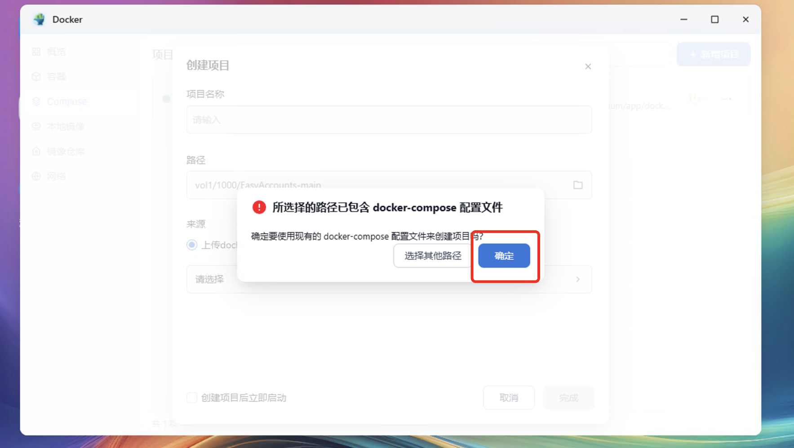 

### 修改compose  
* 新用户：(可以访问dockerhub则跳过该步骤)dockerhub访问不畅可以使用国内镜像：  
将`EasyAccounts/docker-compose-chinese.yml`的内容复制到项目构建框中  
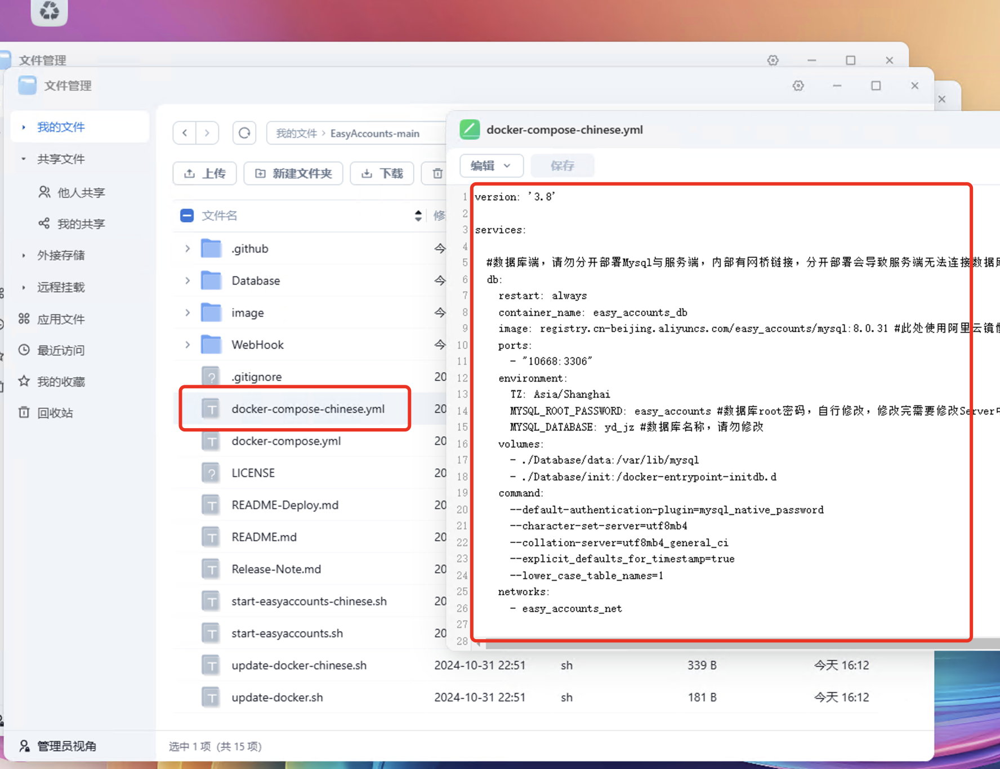 
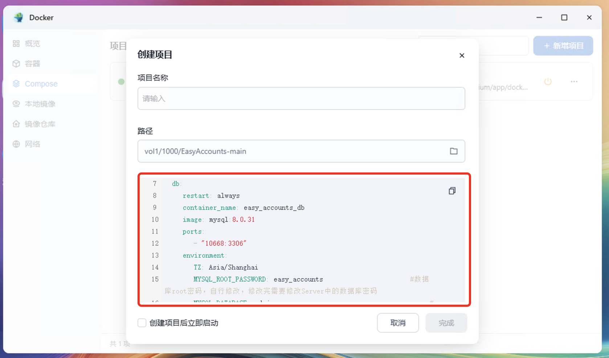 

* 老用户：将自己的compose文件粘贴进入上图的编辑框中即可

按照标准[部署文档](./README-Deploy.md)  修改compose对应的内容，此处不在赘述  

### 构建  
启动构建  
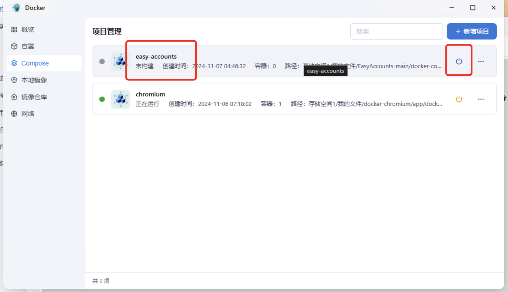 

当db容器日志中出现如下内容表示数据库成功  
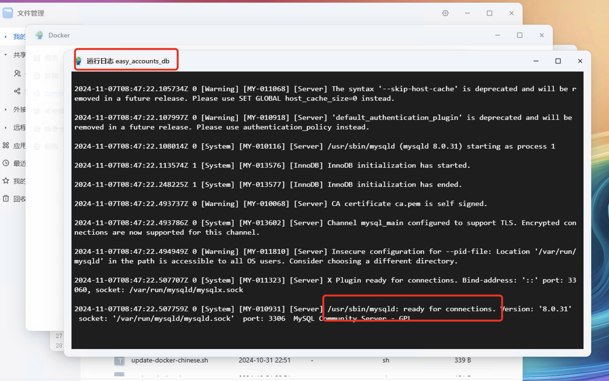 

当server容器日志中出现如下内容表示后台成功  
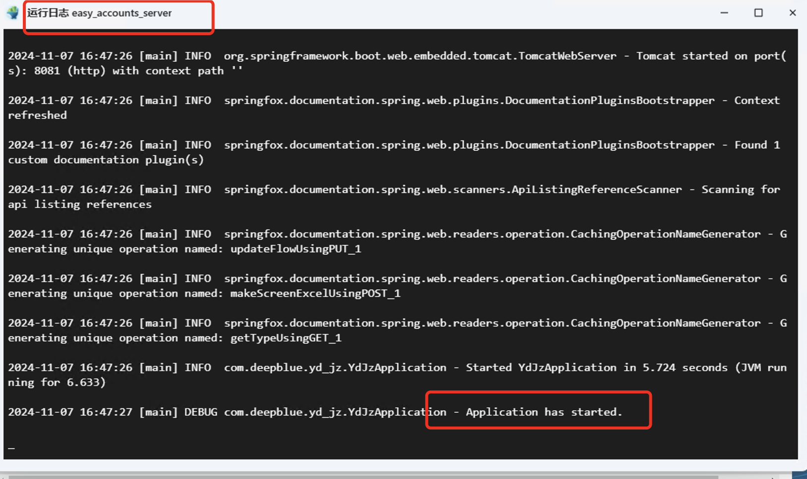 
