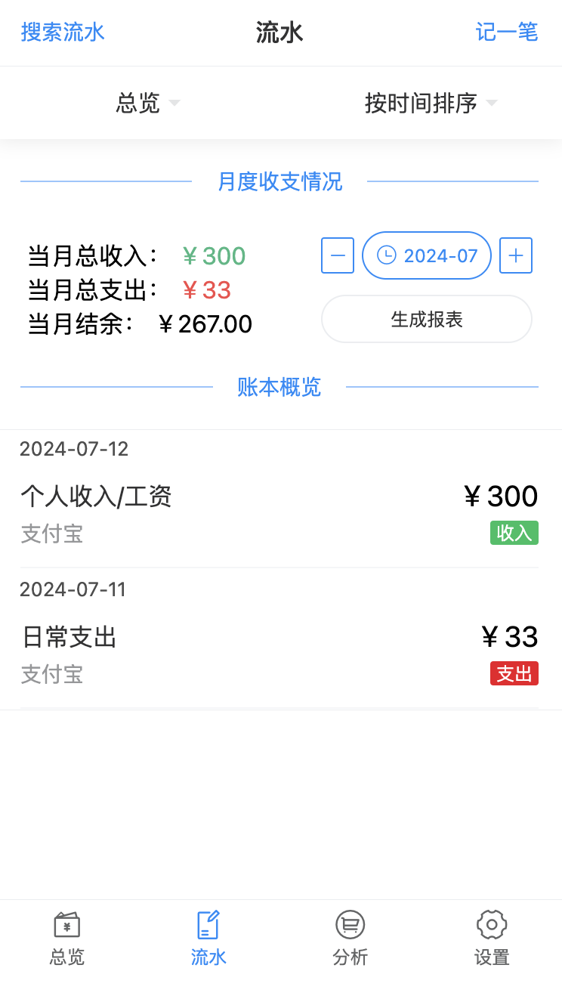
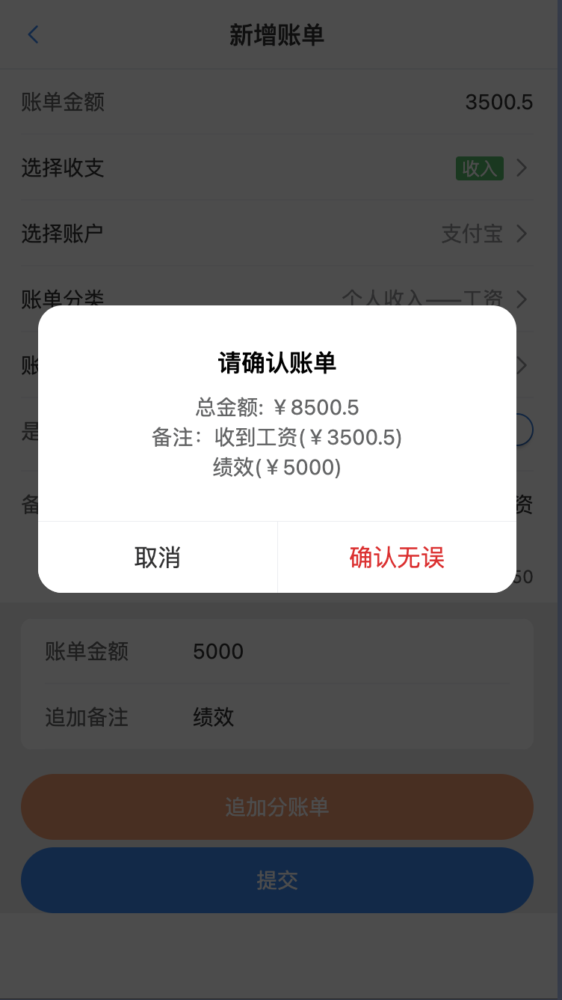
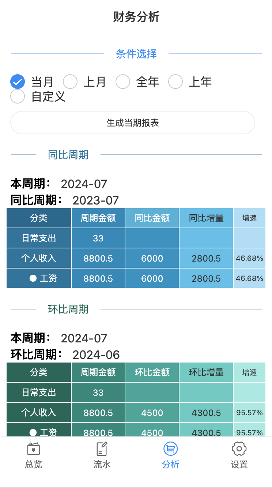
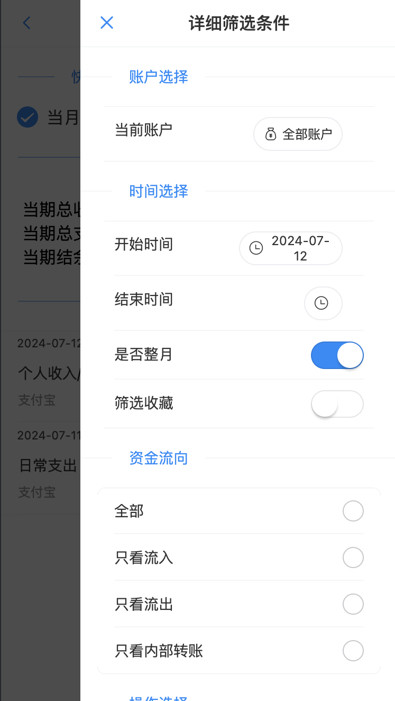
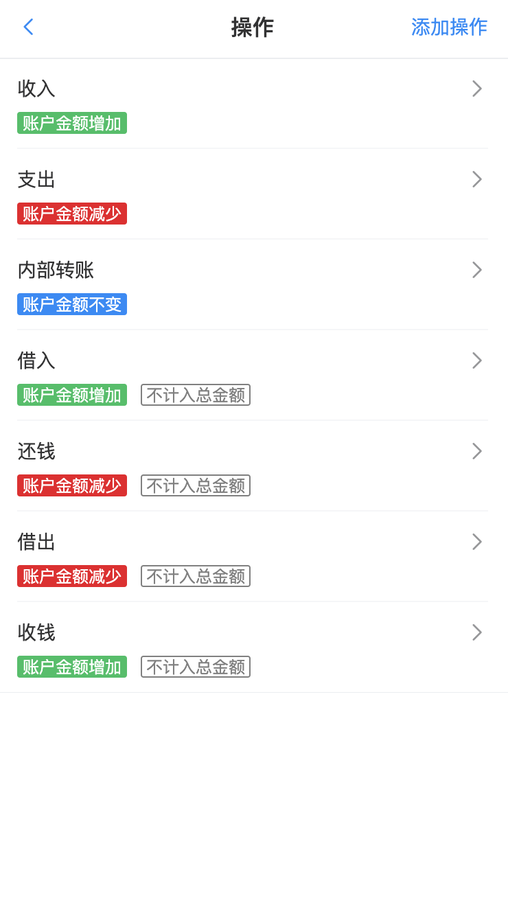

# EasyAccounts  

---
### Update plan：  

- [x] WebHook增加使用自已邮箱功能  
- [ ] 快记模板功能（开发中）
- [ ] 搜索功能  
- [ ] 实验特性，增加baidu或者千问等GPT文本模型接口
---

**中文记账软件**  
EasyAccounts是一款中文记账软件，主要的作用是简易记账  
特色功能有，生成Excel账单，定时备份数据库、账单数据  
|  [项目部署](./README-Deploy.md) ｜ 功能介绍 |    

## 功能  
使用功能详见：  [【开源记账软件 EasyAccounts 使用教程-哔哩哔哩】 ](https://b23.tv/BV1Ds421w78S)  
截图等详见： [关于我写的个人记账软件方案 - 四点不在线的小能猫的文章 - 知乎](https://zhuanlan.zhihu.com/p/645208377)

项目主体功能是基于账户的记账，所有的金额都是基于账户来进行的。  
## 部分截图  
<table>
  <tr width="70%">
    <td></td>
    <td></td>
    <td></td>
    <td></td>
  </tr>
    <tr width="70%">
    <td></td>
    <td></td>
    <td></td>
    <td></td>
  </tr>
</table>

### 可以定义的操作有
1. 账户：有金额、名称等选项。
2. 操作：收入、支出、借入、借出、内部转账等选项，此项目我已经再初始化数据库中添加了常用的几项，足够覆盖生活99%以上的场景，不建议修改。  
3. 类型：有一二级类型，例如用车支出，下属可以选择：加油、保险，具体选项参考自己日常生活，需要注意的是，分类与操作没有关联，你可以叫做 “我的收入”,但是你记账的时候可以选择“支出”操作，**分类仅用于快捷记录使用**。  

### 记账功能  
选择账户->选择操作->选择记账类型->输入金额->保存。  
一条账目就记录完毕，所在金额会在选择的账户中增加或减少。  

### 报表功能  
一共可以生成三种文档：
- 月度账单：生成一个月的账单。
    - 位置：主页流水选项卡里，如果你有流水记录，点击生成报表，没有记录的话就没有这个按钮。
    - 可以生成一个月的流水账单，有一点一定要记住，生成账单的时间点，再excel里面是会有你所有的账户金额的，所以如果你再5月记账，生成4月的账单，那么4月的账单里面是有5月的账户金额的，所以生成账单的时候一定要注意时间点。**请在记录当月的流水之前，生成上个月的账单。**
- 筛选账单：生成筛选的账单。
    - 位置：主页点击总览，然后点击筛选按钮，选择筛选条件，然后点击生成报表。
    - 生成报表前，记得点筛选验证数据，如果没有筛选结果数据，是不会生成报表的，接口会报错，哈哈哈，这是一个小bug，我懒得改了。
- 分析报表：生成分析同环比报表。
    - 位置：主页点击分析选项卡，然后选择周期，点击生成报表。
    - 生成完的同比环比数据会汇总到一个Excel表格中，可以查看同比环比数据。

### 筛选功能  
基本所有的操作包括类型，都可以算作筛选的选项，得到结果后可以手动生成xls。  

### 备份功能  
启动项目的时候可以设置SQL备份日期规则，使用cron规则，详情见docker-compose.yml文件中的环境变量。  
备份的文件会存放在Resource/sql目录下，文件名为日期.sql。  
Excel生成后，会自动备份到Resource/excel目录下，对应上面三个账单的文件夹。  

### WebHook功能(发送邮件)  
WebHook是一个发送邮件，和处理SQL备份的功能，可以在docker-compose.yml中配置。  
具体使用方法见：[WebHook使用说明](./WebHook/README.md)  
配置好发送邮件功能后，就可以在手机上接收excel以及SQL文件了，效果如下：  

  
### 其他功能  
1. Swagger接口文档，可以查看接口文档，支持自定义开发前端。  

2. Nginx提供生成文件的下载服务，可以直接下载生成的文件  

  
上述两个地址详见：[项目部署-项目访问](https://github.com/QingHeYang/EasyAccounts/blob/main/README-Deploy.md#%E9%A1%B9%E7%9B%AE%E6%9C%8D%E5%8A%A1%E8%AF%B4%E6%98%8E)  

## 注意  
如果你不会写代码也无所谓，但是一定要记得定时备份数据库文件、Excel文件。  

还有就是要注意，项目是没有使用任何Auth鉴权的，所以一定要注意项目的安全性。
我是不推荐暴露端口到公网的，如果你要暴露端口到公网，一定要注意安全性。  

基于上述原则，后需我大概率不会增加登录功能，因为没有任何系统是安全的，何况是个人开发者的项目。  

## 部署&更新
参阅部署文档  : [项目部署](./README-Deploy.md)  

## 结语  
该项目会长期维护下去  
如果该项目对你有帮助，欢迎Star，如果有问题，欢迎提issue。  
维护一个项目不容易，如果你愿意支持一下，可以请我喝杯咖啡。  
<table>
  <tr width="70%">
    <td>
     
    </td>
    </td>
    <td>
    </td>
</tr>
</table>