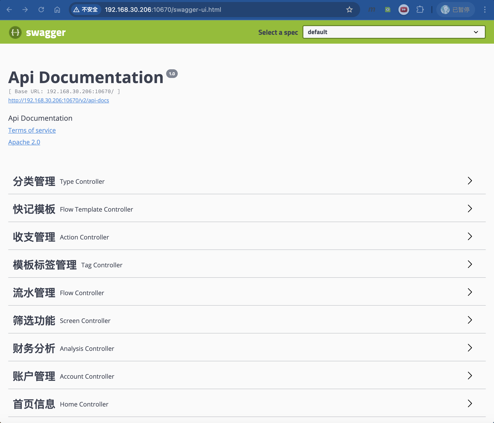

# EasyAccounts  
## 简介
EasyAccounts是一款**开源中文记账软件**  
如果恰好你也是一个喜欢记账的人，并且符合下面的项目要求  
如果你对互联网上的记账App不放心，如果你怕**信息泄露**，如果你怕几年的**数据丢失**  
🎉🎉🎉也许这个项目能满足你的需求  
### 面向受众：
- 家庭🏠✅
- 个人👨‍💼✅

> 项目无法支撑团队记账，所以不推荐团队使用。👥❌

### 项目要求
- 💻有一定的计算机基础
- 🐳会部署Docker
- 📖理解记账的基本概念
- 🥘有可以部署的平台(见下文)
### 支持平台  
* Ubuntu&Debain  
* Windows  
* Mac OS  
* 飞牛私有云 Fnos  

### 项目特点
- 记账基础维度：
  - 账户
  - 收支操作
  - 分类
  - 明细

- 数据筛选维度：
  - 时间
  - 账户
  - 分类(2级)
  - 备注

- 易用性维度：
  - 自己设置模板，3步一笔账
  - 生成Excel账单，自己制作账本
  - 定时备份数据库
  - 账单数据推送
---

### 项目主页
具体内容见项目主页：[GitBook](https://mercys-organization-2.gitbook.io/easyaccounts/)  
项目部署说明：[项目部署](https://mercys-organization-2.gitbook.io/easyaccounts/deploy/deploy)

## 更新计划
### 2025 Update plan：  
更新计划  
本来投入到另外一个项目中，后来多方面的原因，进度有些推不动  
今年还会做一些开发，大概有下面的几个内容  
- [ ] 增加数据库切换，Mysql / sqlite  
- [x] ~~增加鉴权功能，主要是用户名和密码~~  
- [ ] 桌面端开发，预计是Electron  
- [ ] 安卓移动端开发 （苹果我没有账号）  

### 2.4.0 Feature 
更新日期：2025-02-07  
更新视频：[【开源记账软件 EasyAccounts v2.4.0 新版本说明】 ](https://www.bilibili.com/video/BV1P1NPe4Er8/?share_source=copy_web&vd_source=d0722b43e81cb8a8b7ef09b76193df8d)
- 重要特性
  - 增加登录功能，可以通过compose来开启关闭，compose不设置，默认关闭
  - 增加统计功能，原财务分析页面作废，统计功能为按分类统计汇总，按单项分类汇总，可按月查看单项分类
- 新增功能
  - 增加点击生成Excel报表后反馈，变为同步式等待
  - webhook修改逻辑判断
  - 重构总览界面，增加当年月度概览，账户详情转移至顶部
  - 记一笔按钮转移至明细（原流水）界面底部，可以拖动（电脑端可点击）
  - 筛选入口转移至原记一笔位置，主页不在提供筛选选项卡
  - 筛选默认开启备注搜索明细
  - 分类管理增加不参与统计选项，不参与统计的分类不会出现在统计页面
- fixbugs
  - 修复主页请求500错误，跨年后请求错误
  - 修复webhook发送邮件，多收件人可能发送失败问题
  - 生成历史月份Excel，报表中账户金额可以追溯
- 技术特性
  - 增加外部Mysql数据库支持，可以通过compose来开启关闭，compose不设置，默认关闭
  - 前端VUE2->VUE3
  - 前端组件Vant2->Vant4

### 升级教程及历史版本
[Release-Note](https://mercys-organization-2.gitbook.io/easyaccounts/release-notes)  
  

## 功能  
使用功能详见：  [【开源记账软件 EasyAccounts 使用教程-哔哩哔哩】 ](https://b23.tv/BV1Ds421w78S)  
知乎等详见： [关于我写的个人记账软件方案 - 四点不在线的小能猫的文章 - 知乎](https://zhuanlan.zhihu.com/p/645208377)

### 部分截图  
<table>
  <tr width="80%">
    <td>
      
      
总览

    </td>
    <td>
      
      
明细

    </td>
    <td>
      
      
统计

    </td>
    <td>
      
      
设置

    </td>
  </tr>
  <tr width="80%">
    <td>
      
      
总览账户

    </td>
    <td>
      
      
新增明细

    </td>
    <td>
      
      
筛选

    </td>
    <td>
      
      
分类界面

    </td>
  </tr>
  <tr width="80%">
    <td>
      
      
分类列表

    </td>
    <td>
      
      
分类单项统计

    </td>
    <td>
      
      
统计图表

    </td>
    <td>
      
      
登录

    </td>
  </tr>

</table>

<table>
  <tr width="80%">
    <td>
      
      
Swagger 文档

    </td>
    <td>
      
      
Nginx 文件下载

    </td>
  </tr>
   <tr width="70%">
    <td>
      
      
Email 推送

    </td>
    <td>
      
      
Excel 生成

    </td>
   
  </tr>
</table>

### 项目功能导图  
  

### 可以定义的操作有
1. 账户：有金额、名称等选项。
2. 收支：收入、支出、借入、借出、内部转账等选项，此项目我已经再初始化数据库中添加了常用的几项，足够覆盖生活99%以上的场景，不建议修改。  
3. 分类：有一二级类型，例如用车支出，下属可以选择：加油、保险，具体选项参考自己日常生活，~~需要注意的是，分类与操作没有关联，你可以叫做 “我的收入”,但是你记账的时候可以选择“支出”操作，**分类仅用于快捷记录使用**。~~  
（新版本中 分类已经与收支关联）

### 记账功能  
选择账户->选择操作->选择记账类型->输入金额->保存。  
一条账目就记录完毕，所在金额会在选择的账户中增加或减少。  

### 报表功能  
一共可以生成2种Excel文档：
- 月度账单：生成一个月的账单。
    - 位置：主页流水选项卡里，如果你有流水记录，点击生成报表，没有记录的话就没有这个按钮。
    - 可以生成一个月的流水账单，有一点一定要记住，生成账单的时间点，再excel里面是会有你所有的账户金额的，所以如果你再5月记账，生成4月的账单，那么4月的账单里面是有5月的账户金额的，所以生成账单的时候一定要注意时间点。**请在记录当月的流水之前，生成上个月的账单。**
- 筛选账单：生成筛选的账单。
    - 位置：主页点击总览，然后点击筛选按钮，选择筛选条件，然后点击生成报表。
    - 生成报表前，记得点筛选验证数据，如果没有筛选结果数据，是不会生成报表的，接口会报错，哈哈哈，这是一个小bug，每一次更新我都忘记修改。
- ~~分析报表：生成分析同环比报表。~~（新版本无分析报表）
    - ~~位置：主页点击分析选项卡，然后选择周期，点击生成报表。~~
    - ~~生成完的同比环比数据会汇总到一个Excel表格中，可以查看同比环比数据。~~

### 筛选功能  
基本所有的操作包括类型，都可以算作筛选的选项，得到结果后可以手动生成xls。  

### 备份功能  
启动项目的时候可以设置SQL备份日期规则，使用cron规则，详情见docker-compose.yml文件中的环境变量。  
备份的文件会存放在Resource/sql目录下，文件名为日期.sql。  
Excel生成后，会自动备份到Resource/excel目录下，对应上面三个账单的文件夹。  

### WebHook功能(发送邮件)  
WebHook是一个发送邮件，和处理SQL备份的功能，可以在docker-compose.yml中配置。  
具体使用方法见：[WebHook使用说明](https://mercys-organization-2.gitbook.io/easyaccounts/deploy/webhook)  
配置好发送邮件功能后，就可以在手机上接收excel以及SQL文件了，效果如下：  

  
### 其他功能  
1. Swagger接口文档，可以查看接口文档，支持自定义开发前端。  
  
2. Nginx提供生成文件的下载服务，可以直接下载生成的文件  
  
  
上述两个地址详见：[项目部署-项目访问](https://mercys-organization-2.gitbook.io/easyaccounts/deploy/deploy#xiang-mu-fang-wen)  

## 项目贡献  
请阅读贡献指南：[贡献指南](https://mercys-organization-2.gitbook.io/easyaccounts/develop/contributing)

## 开发声明  
2021年9月-2025年2月开发已有3年5余月  
项目需求做了不少变更，未来还会有不少更新  
因为我个人能力有限，可能会某一次更新中出现纰漏，请大家多包容一些  
所以请大家一定保护好自己的sql备份数据，bug可以修复，项目可以重新部署，excel可以重新生成，但是sql备份丢了，那就真没什么办法了  

自2024年年初，本项目开始大范围使用ai编程，其中包括chatGpt，copilot，cursor，claude，Qwen，文心一言  
所以源码中有些注释比较糙，请多理解（我一个旧时代的android工程师能做到这样已经很不容易了啊喂！！）  

## 结语  
这个项目会一直维护下去，因为它是我自己经常使用的工具。如果你有任何关于记账的好点子，随时告诉我，我会根据情况考虑添加。

如果这个项目对你有所帮助，欢迎点个Star；如果遇到问题，欢迎提issue。  
我承诺，项目将继续免费且公益，好的创意我会不断更新。

另外，作为一个超级社恐的开发者，有时我可能会稍微迟疑添加别人微信，请大家多包容🤝。  
（我真的很社恐，不敢加别的开发者微信，不敢建群）

🎁 **爱心传送门**  
如果你愿意支持EasyAccounts：  
扫描下方二维码即可献爱心

所有善款都会带着「捐赠者大名」飞奔到**腾讯公益孤儿救助项目**。

捐赠款项我会以**捐赠者备注**的名义，转赠至**腾讯公益的孤儿救助项目**，感谢每一位支持的朋友。  
捐赠者名单会定期更新，感谢大家的支持与厚爱🙏。(今天收到了第一笔陌生朋友的转账，被认可的感觉真好啊)
<table>
  <tr width="70%">
    <td>
     
    </td>
    </td>
    <td>
    </td>
</tr>
</table>