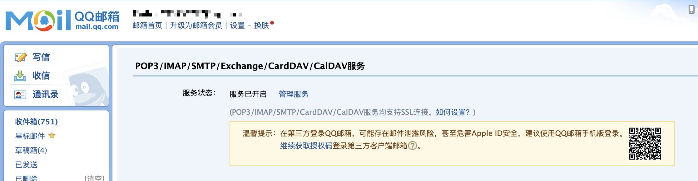
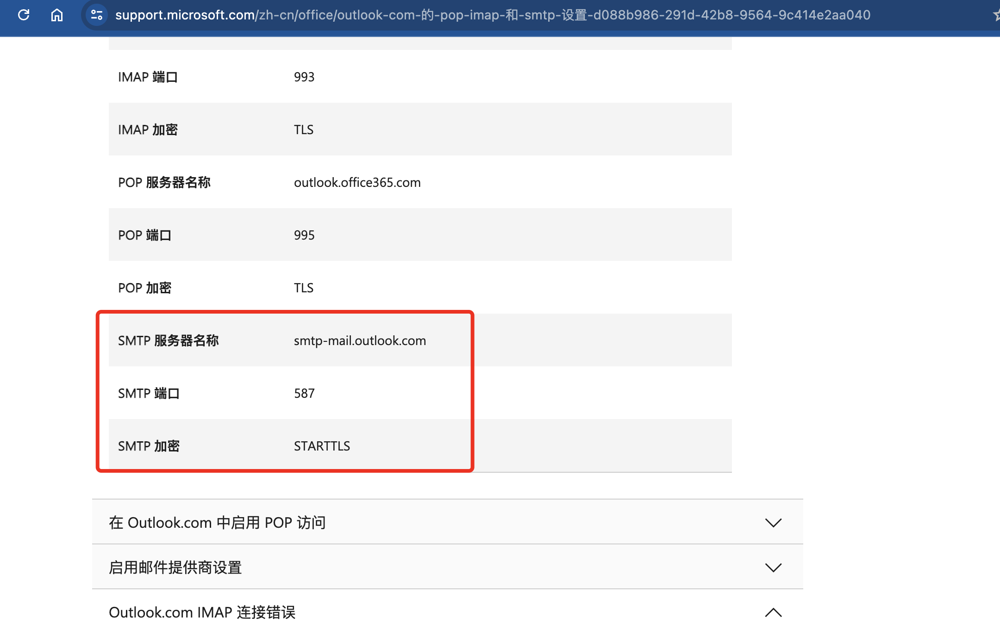

# WebHook功能介绍 
WebHook是一种通过自定义HTTP回调来实现的事件通知机制。当事件发生时，WebHook会向预先设定的URL发送HTTP请求，以通知事件的发生。  

## Compose内容  
```yaml
webhook:
    image: registry.cn-beijing.aliyuncs.com/easy_accounts/easyaccounts-webhook:latest #此处使用阿里云镜像
    container_name: easy_accounts_webhook
    restart: always
    ports:
      - "10671:8083"
    volumes:
      - ./WebHook:/app/
      #- ./WebHook/webhook.py:/app/webhook.py           #如果要自行处理文件，则取消这行注释，映射该文件，则下方的环境变量无效
      - ./WebHook/webhook-email.py:/app/webhook.py     #如需修改发送邮件服务，请解开此行注释
    environment:
      - LOG_FILE=/app/hook.log
      - SEND_SQL_BACKUP=True                  # 是否发送SQL备份文件,默认True
      - SEND_EXCEL=True                       # 是否发送Excel文件，默认True

      # -------------------以下为发送邮件服务的环境变量-------------------
      - SMTP_SERVER=                          # SMTP服务器地址
      - SMTP_PORT=                            # SMTP端口
      - SMTP_MAIL=                            # 发件人邮箱，一般来说是SMTP账号，例如自己的QQ邮箱
      - SMTP_PASSWORD=                        # SMTP密码,一般来说是SMTP账号的授权码,需要自己去自己的邮箱中找到设置
      - SMTP_TO_LIST=                         # 收件人邮箱列表，用逗号分隔

    networks:
      - easy_accounts_net
```
## WebHook使用说明  
1. WebHook功能需要在EasyAccounts项目中启动，启动后会监听`10671`端口  
2. WebHook 有两个具体实现的功能类，分别是：  
    - `webhook.py`  
    - `webhook-email.py`  

### webhook.py  
此类的主要功能是提供一个示例，用于展示如何使用WebHook功能，提供了一个保存文件的工具类，并未实现具体发送功能。  

### webhook-email.py  
默认使用的是该文件进行的发送邮件
此类是发送邮件的具体实现，使用了`email`模块，需要配置邮件服务器的相关信息。  
在 docker-compose.yml 中配置了邮件服务器的相关信息，如下：  
```yaml
  environment:
      - LOG_FILE=/app/hook.log
      - SEND_SQL_BACKUP=True                  # 是否发送SQL备份文件,默认True
      - SEND_EXCEL=True                       # 是否发送Excel文件，默认True

      # -------------------以下为发送邮件服务的环境变量-------------------
      - SMTP_SERVER=                          # SMTP服务器地址
      - SMTP_PORT=                            # SMTP端口
      - SMTP_MAIL=                            # 发件人邮箱，一般来说是SMTP账号，例如自己的QQ邮箱
      - SMTP_PASSWORD=                        # SMTP密码,一般来说是SMTP账号的授权码,需要自己去自己的邮箱中找到设置
      - SMTP_TO_LIST=                         # 收件人邮箱列表，用逗号分隔
```  

发送邮件的协议为SMTP,暂不支持别的协议，需要配置SMTP服务器的相关信息，不同的邮件供应商有不同的SMTP服务器地址和端口，例如QQ邮箱的SMTP服务器地址为`smtp.qq.com`，端口为`587`。  
如果想使用不同的供应商，需要自行去自己的邮箱找对应的配置信息。  
例如QQ邮箱：  
  
Outlook邮箱：  
  

目前测试通过的邮件服务商有：  
- QQ邮箱
- outlook邮箱  

## 使用方法  
1. 在`docker-compose.yml`或者`docker-compose-chinese.yml`中配置WebHook服务  
2. 启动EasyAccounts项目  

## 自定义开发  
解开`docker-compose.yml`中的注释，将`webhook.py`或者`webhook-email.py`映射到容器中，即可自定义开发。  
```yaml
    volumes:
      - ./WebHook:/app/
      #- ./WebHook/webhook.py:/app/webhook.py           #如果要自行处理文件，则取消这行注释，映射该文件，则下方的环境变量无效
      - ./WebHook/webhook-email.py:/app/webhook.py     #如需修改发送邮件服务，请解开此行注释
```  
开发注意事项：  
Docker容器内的环境包只有如下内容：  
```
fastapi==0.111.0
pydantic==2.7.1
Requests==2.32.2
```

## 日志查看
日志文件默认保存在`WebHook/hook.log`中。

## 注意事项  
邮箱端口请使用TLS加密端口，不支持SSL加密。  
日志文件默认保存在`/app/hook.log`中，可以通过`LOG_FILE`环境变量进行修改。  