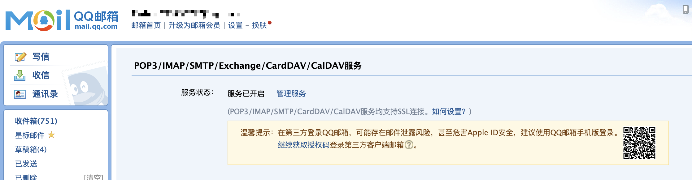
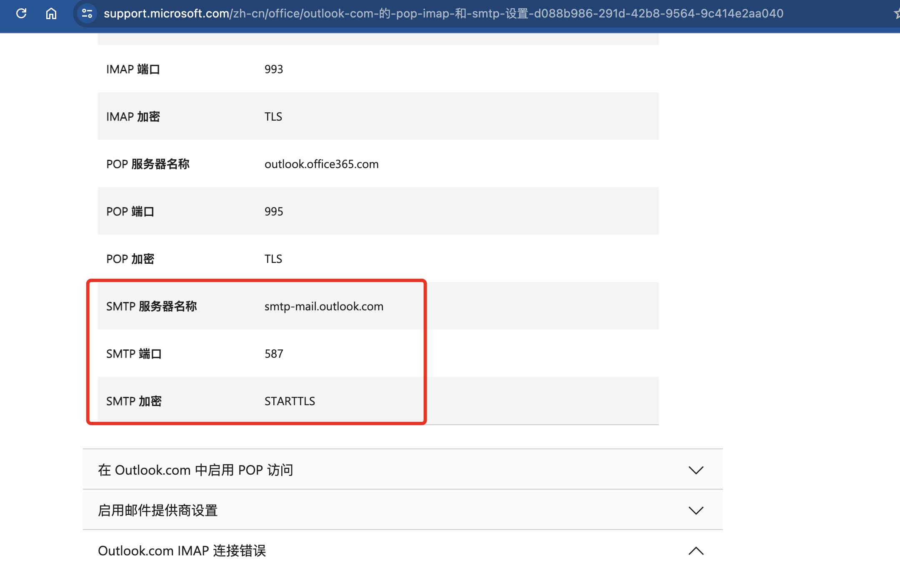

# WebHook功能介绍


**v2.7.0 起 WebHook 模块已废弃**

邮件发送能力已内聚到 server 容器，原 `easyaccounts-webhook` 镜像、`webhook:` 服务块、所有 `SMTP_*` 环境变量均不再使用。

**v2.7.0+ 用户请到前端「系统设置 → 邮件」中配置 SMTP**，改完立即生效，无需重启容器。

本文档保留供 **v2.6.x 及更早版本** 用户参考。


***

当点击生成 Excel 的时候，当 SQL 数据库备份发生的时候，server 容器会将这些文件发送到 WebHook 容器中。

你可以自己编写 Python 文件来处理这些文件，比如发送邮件、保存到指定目录等操作。

我预先内置了一套发送 Email 的脚本，一套保存文件到本地的脚本，使用者可以根据自己的需求进行修改。


**注意**：默认情况下 WebHook 的 volumes 映射是注释掉的，容器会使用内置的默认脚本。如需自定义功能，需要先创建对应文件，然后解开注释。


## Compose内容

```yaml
webhook:
    image: 775495797/easyaccounts-webhook:1.0.0
    container_name: easy_accounts_webhook
    restart: always
    volumes:
      # 以下映射需先创建对应文件/文件夹后再解开注释，否则会报错
      #- ./WebHook:/app/                                  # 自定义 webhook 脚本目录
      #- ./WebHook/webhook.py:/app/webhook.py            # 自定义处理脚本
      #- ./WebHook/webhook-email.py:/app/webhook.py      # 使用邮件发送脚本
    environment:
      - TZ=Asia/Shanghai
      - LOG_FILE=/app/hook.log
      - SEND_SQL_BACKUP=True                  # 是否发送SQL备份文件，默认True
      - SEND_EXCEL=True                       # 是否发送Excel文件，默认True

      # -------------------以下为发送邮件服务的环境变量-------------------
      - SMTP_SERVER=                          # SMTP服务器地址
      - SMTP_PORT=                            # SMTP端口
      - SMTP_MAIL=                            # 发件人邮箱，一般来说是SMTP账号，例如自己的QQ邮箱
      - SMTP_PASSWORD=                        # SMTP密码，一般来说是SMTP账号的授权码
      - SMTP_TO_LIST=                         # 收件人邮箱列表，用逗号分隔

    networks:
      - easy_accounts_net
```

## Volumes 映射说明

| 映射                                           | 说明              | 使用场景             |
| -------------------------------------------- | --------------- | ---------------- |
| `./WebHook:/app/`                            | 映射整个 WebHook 目录 | 需要自定义多个脚本或查看日志文件 |
| `./WebHook/webhook.py:/app/webhook.py`       | 映射自定义处理脚本       | 自行编写处理逻辑         |
| `./WebHook/webhook-email.py:/app/webhook.py` | 映射邮件发送脚本        | 使用内置的邮件发送功能      |

**使用步骤**：

1. 从 [GitHub](https://github.com/QingHeYang/EasyAccounts/tree/gh-pages/WebHook) 下载对应的脚本文件
2. 在项目根目录创建 `WebHook` 文件夹，将脚本放入
3. 解开 docker-compose.yml 中对应的注释
4. 重启 webhook 容器：`docker compose restart webhook`

## WebHook使用说明

1. WebHook功能需要在EasyAccounts项目中启动，启动后会监听`10671`端口
2. WebHook 有两个具体实现的功能类，分别是：
   * `webhook.py`
   * `webhook-email.py`

### webhook.py

此类的主要功能是提供一个示例，用于展示如何使用WebHook功能，提供了一个保存文件的工具类，并未实现具体发送功能。

### webhook-email.py

默认使用的是该文件进行的发送邮件 此类是发送邮件的具体实现，使用了`email`模块，需要配置邮件服务器的相关信息。\
在 docker-compose.yml 中配置了邮件服务器的相关信息，如下：

```yaml
  environment:
      - LOG_FILE=/app/hook.log
      - SEND_SQL_BACKUP=True                  # 是否发送SQL备份文件,默认True
      - SEND_EXCEL=True                       # 是否发送Excel文件，默认True

      # -------------------以下为发送邮件服务的环境变量-------------------
      - SMTP_SERVER=                          # SMTP服务器地址
      - SMTP_PORT=                            # SMTP端口
      - SMTP_MAIL=                            # 发件人邮箱，一般来说是SMTP账号，例如自己的QQ邮箱
      - SMTP_PASSWORD=                        # SMTP密码,一般来说是SMTP账号的授权码,需要自己去自己的邮箱中找到设置
      - SMTP_TO_LIST=                         # 收件人邮箱列表，用逗号分隔
```

发送邮件的协议为SMTP,暂不支持别的协议，需要配置SMTP服务器的相关信息，不同的邮件供应商有不同的SMTP服务器地址和端口，例如QQ邮箱的SMTP服务器地址为`smtp.qq.com`，端口为`587`。\
如果想使用不同的供应商，需要自行去自己的邮箱找对应的配置信息。\
例如QQ邮箱：\
\
Outlook邮箱：\


目前测试通过的邮件服务商有：

* QQ邮箱
* outlook邮箱

## 使用方法

1. 在 `docker-compose.yml` 中配置 WebHook 配置项
2. 启动 EasyAccounts 项目

## 自定义开发

1. 下载脚本模板文件到 `WebHook` 目录
2. 解开 `docker-compose.yml` 中对应的注释
3. 修改脚本实现自己的逻辑

**开发注意事项**：

Docker 容器内的环境包只有如下内容：

```
fastapi==0.111.0
pydantic==2.7.1
Requests==2.32.2
```

如果想增加包，请到 [EasyAccountOpenSource](https://github.com/QingHeYang/EasyAccountsOpenSource) 中的 WebHook 重新构建镜像。

## 日志查看

* 如果映射了 `./WebHook:/app/`，日志文件保存在 `WebHook/hook.log`
* 如果未映射，可通过 `docker logs easy_accounts_webhook` 查看

## 注意事项

* 邮箱端口请使用 TLS 加密端口，不支持 SSL 加密
* **重要**：映射文件前必须先创建对应文件，否则 Docker 会将其当作目录创建，导致容器启动失败
